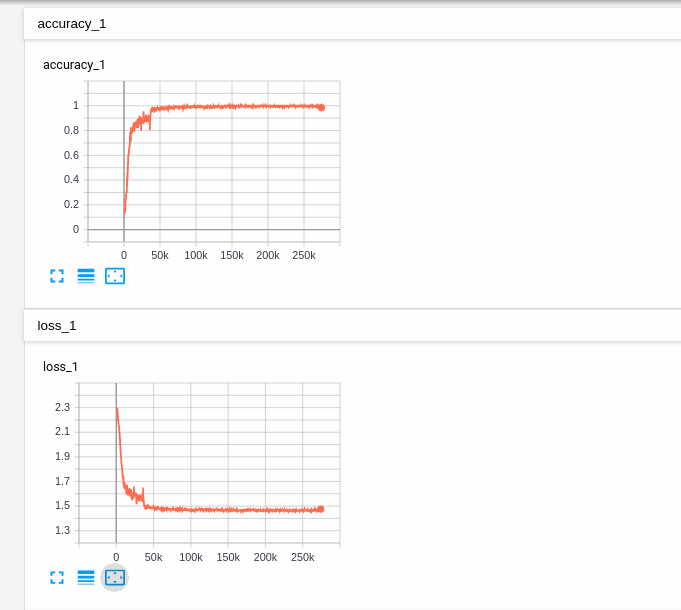
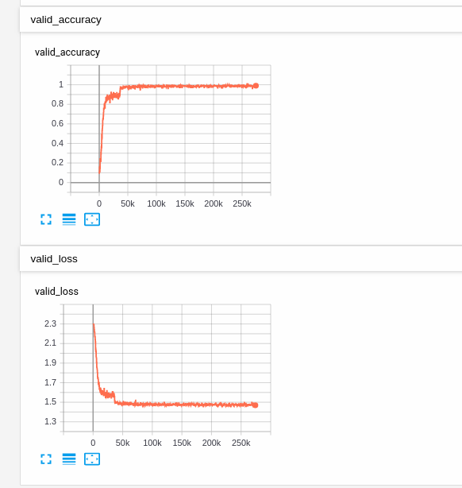

## a lstm network

a program to recognize the images in mnist dataset by the lstm. The following is the origin link to the mnist dataset.
-  [mnist dataset](http://yann.lecun.com/exdb/mnist/)

## result
the result of training curves:

